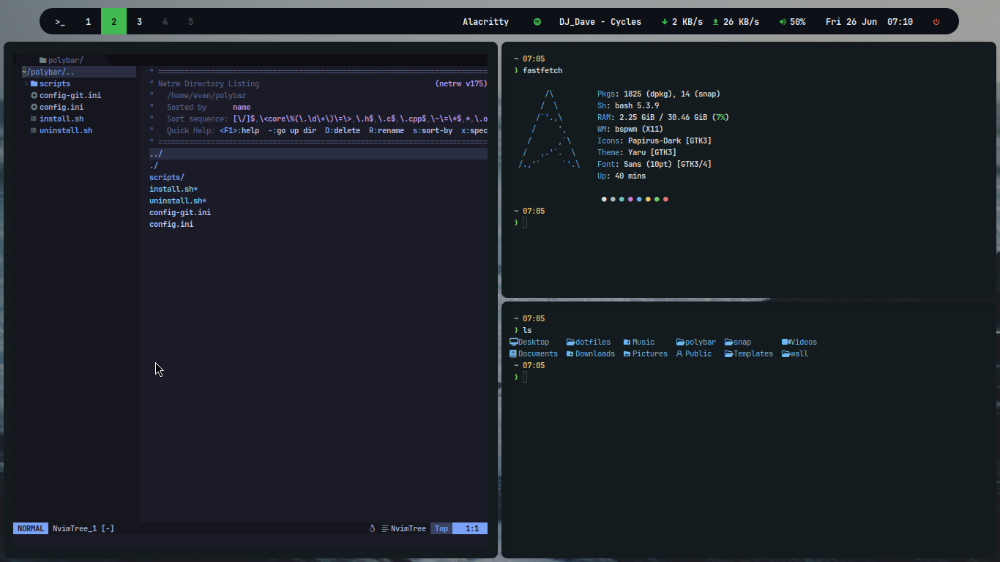

<p align="center">
  <b>Evan's Linux Dotfiles</b>
</p>

<p align="center">


</p>

<br>



Personal BSPWM dotfiles running on Ubuntu (X11), using a custom dark colorscheme inspired by [Everblush](https://github.com/mangeshrex/everblush.vim).

| Component | Tool |
|---|---|
| Window Manager | [BSPWM](https://github.com/baskerville/bspwm) |
| Hotkey Daemon | [sxhkd](https://github.com/baskerville/sxhkd) |
| Bar | [Polybar](https://github.com/polybar/polybar) |
| Compositor | [Compix](https://github.com/xeome/compix) |
| Terminal | [Alacritty](https://github.com/alacritty/alacritty) / [Kitty](https://sw.kovidgoyal.net/kitty) |
| Launcher | [Rofi](https://github.com/davatorium/rofi) |
| Widgets | [Eww](https://github.com/elkowar/eww) |
| Text Editor | [Neovim](https://neovim.io) / [VS Code](https://code.visualstudio.com) |
| File Manager | [Nautilus](https://apps.gnome.org/Nautilus) |
| Browser | [Firefox](https://www.mozilla.org/firefox) / [Google Chrome](https://www.google.com/chrome) |
| GTK Theme | Adwaita-dark + custom `gtk.css` |
| Icon Theme | [Papirus-Dark](https://github.com/PapirusDevelopmentTeam/papirus-icon-theme) |
| Lockscreen | [i3lock](https://github.com/i3/i3lock) |
| Screenshot | [Flameshot](https://flameshot.org) / [maim](https://github.com/naelstrof/maim) |
| Clipboard | [clipmenu](https://github.com/cdown/clipmenu) |
| System Info | [Fastfetch](https://github.com/fastfetch-cli/fastfetch) |
| PDF Viewer | [Zathura](https://pwmt.org/projects/zathura) |
| Image Viewer | [nsxiv](https://github.com/nsxiv/nsxiv) |

<br>

## Color Palette

| Role | Hex |
|---|---|
| Background | `#0a1114` |
| Surface | `#141b1e` |
| Overlay | `#1d2527` |
| Muted | `#3b4244` |
| Foreground | `#dadada` |
| Accent (blue) | `#67b0e8` |
| Green | `#70ca6d` |
| Red | `#e57474` |
| Yellow | `#e5c76b` |

<br>

## Notes

- Fonts: [JetBrainsMono Nerd Font](https://www.nerdfonts.com) and [Iosevka Nerd Font](https://www.nerdfonts.com). Install manually from Nerd Fonts.
- Alacritty uses TOML config format (`alacritty.toml`) — compatible with Alacritty v0.13+.
- Neovim colorscheme: [Tokyo Night](https://github.com/folke/tokyonight.nvim).
- Chrome and VS Code are launched with `--ozone-platform=x11` since bspwm runs on X11 only.

### Browser theming

**Firefox** — uses `userChrome.css` and `userContent.css` to restyle the UI. Requires enabling `toolkit.legacyUserProfileCustomizations.stylesheets` in `about:config`. The install script copies the files automatically if a Firefox profile exists.

**Chrome** — includes an unpacked theme extension (`cfg/chrome-theme`). To apply:
1. Open `chrome://extensions`
2. Enable **Developer mode**
3. Click **Load unpacked** → select `~/.local/share/chrome-theme`

<br>

## Installation

```bash
git clone https://github.com/onlyv4ns/ubunturice ~/dotfiles
cd ~/dotfiles
./install.sh
```

The script will automatically:
- Install all required packages via apt
- Build and install [compix](https://github.com/xeome/compix) and [eww](https://github.com/elkowar/eww) from source
- Copy all configs to `~/.config/`
- Install fonts and wallpaper
- Copy the Chrome desktop override (fixes launching from rofi on X11)
- Install the Chrome unpacked theme to `~/.local/share/chrome-theme`
- Install the Firefox chrome theme (if a profile already exists)

> **Post-install notes:**
> - Set your WiFi interface in `~/.config/polybar/config-git.ini` (default: `wlp3s0`)
> - Set your battery adapter name (default: `BAT0` / `ACAD`)
> - For touchpad natural scroll, uncomment the `xinput` line in `~/.config/bspwm/bspwmrc`
> - Open Neovim and run `:Lazy` to install plugins
> - For Firefox theming: run Firefox once first, then re-run `install.sh`

## Keybindings

### General
| Key | Action |
|---|---|
| `Super + Return` / `Ctrl + Alt + T` | Terminal |
| `Super + D` | App launcher (Rofi) |
| `Super + P` | Power menu |
| `Super + Alt + L` | Lockscreen |
| `Super + V` | Clipboard history (Rofi) |
| `Super + Alt + W` | Random wallpaper |
| `Ctrl + Alt + B` | Browser (Chrome) |
| `Ctrl + Alt + D` | Discord |
| `Ctrl + Alt + E` | File manager (Nautilus) |
| `Ctrl + Alt + C` | VS Code |
| `Super + Escape` | Reload sxhkd |

### Screenshot
| Key | Action |
|---|---|
| `Print` | Open screenshot menu (Rofi) |

Screenshot menu options:
| Option | Action |
|---|---|
| Fullscreen | Save to `~/Pictures/Screenshots/` |
| Select Area | Draw selection → save to file |
| Fullscreen → Clipboard | Copy fullscreen to clipboard |
| Select Area → Clipboard | Draw selection → copy to clipboard |
| Annotate (Flameshot) | Open Flameshot GUI for annotation |

### nsxiv
| Key | Action |
|---|---|
| `q` | Quit |
| `f` | Fullscreen |
| `G` | Thumbnail grid |
| `Space` / `Backspace` | Next / Previous image |
| `+` / `-` | Zoom in / out |
| `r` | Rotate 90° clockwise |
| `Enter` | Open from thumbnail |

### Discord (Vencord)
| Key | Action |
|---|---|
| `Ctrl + ,` | Open settings (find Vencord section at bottom) |
| `Ctrl + Shift + I` | DevTools (for debugging) |

### BSPWM — Window
| Key | Action |
|---|---|
| `Super + W` | Close window |
| `Super + Shift + W` | Kill window (force) |
| `Super + {H,J,K,L}` / `Super + Arrows` | Focus window |
| `Super + Shift + {H,J,K,L}` / `Super + Shift + Arrows` | Move window |
| `Super + G` | Swap with largest window |
| `Super + {T,S,F}` | Tiled / Floating / Fullscreen |
| `Super + Shift + T` | Pseudo-tiled |
| `Super + M` | Toggle monocle layout |

### BSPWM — Desktop
| Key | Action |
|---|---|
| `Super + {1-9}` | Switch to desktop |
| `Super + Shift + {1-9}` | Send window to desktop |
| `Super + [` / `Super + ]` | Previous / Next desktop |

### BSPWM — Resize
| Key | Action |
|---|---|
| `Super + Alt + Arrows` | Expand window edge |
| `Super + Alt + Shift + Arrows` | Shrink window edge |

### BSPWM — Preselect
| Key | Action |
|---|---|
| `Super + Ctrl + {H,J,K,L}` | Preselect split direction |
| `Super + Ctrl + {1-9}` | Preselect split ratio |
| `Super + Ctrl + Space` | Cancel preselect |

### BSPWM — Session
| Key | Action |
|---|---|
| `Super + Alt + R` | Restart bspwm |
| `Super + Alt + Q` | Quit bspwm |

### Media
| Key | Action |
|---|---|
| `XF86AudioRaiseVolume` | Volume +5% |
| `XF86AudioLowerVolume` | Volume -5% |
| `XF86AudioMute` | Toggle mute |
| `XF86MonBrightnessUp` | Brightness +5% |
| `XF86MonBrightnessDown` | Brightness -5% |

<br>

## Uninstall

```bash
cd ~/dotfiles
./uninstall.sh
```

Removes all installed configs. Packages are not removed automatically — the commands to do so are shown when the script runs.
